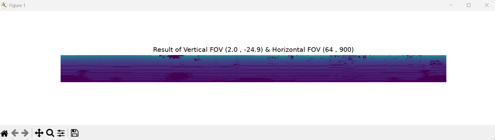

# Undergrad_Research_Mission
학부연구생 과제 저장소입니다.

# [ Q1. ]  위 논문의 3 page [ III. OUR APPROACH - A. Range Image Point Cloud Proxy Representation ] 에서 수식 (1) 이해하기!
### 1. 가로축 픽셀 u 구하기 (수평 방위각 투영)

**[논리적 흐름]**
라이다가 360도 (2*pi) 회전하는 것을 가로 길이가 w인 평면 이미지로 쫙 펼치는 과정입니다.
* 반지름이 r인 원의 둘레(2pi*r)를 이미지 가로 길이 w라고 둡니다. -> r=w/(2pi)
* 현재 점의 각도 (세타 = tan^{-1}(y/x)) (파이썬 구현: `np.arctan2(y, x)`)
* 원호의 길이 $l = r세타를 이용해, 이미지 중심(w/2)을 기준으로 픽셀 위치를 잡습니다.

**[수식의 의미]**
u = 1/2[1-arctan(y,x)*(pi)^-1]w

* arctan(y,x)*(pi)^-1: 각도(-pi~pi)를 pi로 나누어 -1~1 사이의 비율로 만듭니다.
* 1-arctan(y,x)*(pi)^-1: 방향을 뒤집어 주면서 범위를 0~2로 만듭니다. (각도가 커질 때 픽셀이 왼쪽/오른쪽 어느 방향으로 갈지 방향을 맞춰주는 역할)
* 1/2[1-arctan(y,x)*(pi)^-1]: 범위를 다시 반으로 쪼개서 0~1 사이의 완벽한 정규화(Normalization) 값으로 만듭니다.
* 1/2[1-arctan(y,x)*(pi)^-1]w: 마지막으로 이미지 가로 해상도 w를 곱해주면, 0~w 사이의 픽셀 인덱스가 딱 떨어지게 나옵니다.

---

### 2. 세로축 픽셀 v 구하기 (수직 고각 투영)

**[논리적 흐름]**
세로축은 라이다의 상하 시야각(Vertical FOV)을 이미지 세로 길이 h에 대응시키는 과정입니다.

**[수식의 의미]**
v = [1-(arcsin(zr^-1)+f_up)f^-1]h

* arcsin(z/r): 현재 3D 점의 상하 각도입니다. (세타)
* +f_up: 라이다가 위로 볼 수 있는 최대 각도를 더해줍니다. 이렇게 하면 센서의 가장 맨 위쪽 시야 끝을 0도 기준으로 영점을 맞춰주는 효과가 생깁니다.
* f^-1: 영점이 맞춰진 각도를 전체 상하 시야각 (f = f_up+ f_down) 으로 나눕니다. -> 0~1 사이의 비율이 됩니다.
* 1-(arctan(zr^-1)+f_up)f^-1: 이미지 좌표계와의 매칭을 위한 상하 반전입니다. 수학적 각도는 위로 갈수록 커지지만, 이미지는 맨 위가 0번째 픽셀이기 때문에, 1에서 빼주어 위아래 픽셀 위치를 정상적으로 뒤집어 줍니다.
* v = [1-(arctan(zr^-1)+f_up)f^-1]h: 마지막으로 이미지 세로 해상도 h를 곱해주면, 0~h 사이의 픽셀 인덱스가 완성됩니다.

# [ Q2. ] LiDAR 센서의 **f_up과 f_down이 다르다면**, 위 수식을 그대로 사용할 수 있을까? 사용할 수 없다면, 어떤 부분을 어떻게 바꿔야 하는가?

### 1. f_up과 f_down의 정의
* **$f_{\text{up}}$ (상향 시야각 / Upward FOV):** 수평선(0도)을 기준으로 센서가 위쪽으로 쏠 수 있는 가장 높은 레이저의 각도입니다.
* **$f_{\text{down}}$ (하향 시야각 / Downward FOV):** 수평선(0도)을 기준으로 센서가 아래쪽으로 쏠 수 있는 가장 깊은 레이저의 각도입니다. (주로 지면을 향하므로 음수 값을 가집니다.)
* **$f$ (전체 수직 시야각 / Total Vertical FOV):** 센서가 위에서 아래까지 훑을 수 있는 총 상하 각도의 범위입니다.
  * 수식: $f = f_{\text{up}} + |f_{\text{down}}|$

### 2. 위 수식을 그대로 사용할 수 있는가? (결론: 불가능)
**그대로 사용할 수 없습니다.** 논문에 제시된 수식 (1)은 상하 시야각이 완벽히 대칭($f_{\text{up}} = |f_{\text{down}}|$)일 때만 우연히 맞아떨어지는 특수한 형태입니다. 

실제 자율주행에 많이 쓰이는 센서들은 하늘보다 지면을 더 촘촘히 스캔해야 하므로 $f_{\text{up}}$보다 $f_{\text{down}}$의 절댓값이 훨씬 큰 비대칭(Asymmetric) 시야각을 가집니다. 
이러한 비대칭 환경에서 기존 수식에 가장 높은 상향각 ($\theta = f_{\text{up}}$) 을 대입해 보면, 결과값이 0이 나오지 않습니다. 즉, 센서의 맨 윗단 데이터가 이미지의 맨 위(0번 인덱스)에 맺히지 못하고 수직 영점(Horizon)이 통째로 어긋나는 치명적인 문제가 발생합니다.

---

### 3. 어떤 부분을 어떻게 바꿔야 하는가? (수식 수정)
문제를 해결하려면 2D 이미지의 위쪽($v=0$)부터 아래쪽($v=h$)까지 각도를 선형적으로 매핑(Linear Interpolation)하도록 식을 수정해야 합니다. 
기존 수식의 괄호 안에 있는 오프셋을 $f_{\text{up}}$에서 **$|f_{\text{down}}|$**으로 바꾸거나, 아예 직관적인 형태로 식을 재정의해야 합니다.

**[수정된 수식]**
$$v = \left[ 1 - (\arcsin(z r^{-1}) + |f_{\text{down}}|) f^{-1} \right] h$$

---

### 4. 수학적 증명 (검증)
직관적으로 바꾼 수식에 실제 센서의 한계 고각($\theta = \arcsin(z r^{-1})$) 양끝값을 대입해 보면, 이미지 배열의 픽셀 인덱스에 완벽하게 들어맞는 것을 증명할 수 있습니다.

* **맨 위를 볼 때 (Top Edge, $\theta = f_{\text{up}}$)**
  $$v = \left[ 1 - \frac{f_{\text{up}} + |f_{\text{down}}|}{f} \right] h = [1 - 1] h = 0$$
  $\rightarrow$ 캔버스의 맨 위쪽 줄(0번째 인덱스)에 정확히 안착

* **맨 아래를 볼 때 (Bottom Edge, $\theta = -|f_{\text{down}}|$)**
  $$v = \left[ 1 - \frac{-|f_{\text{down}}| + |f_{\text{down}}|}{f} \right] h = [1 - 0] h = h$$
  $\rightarrow$ 캔버스의 맨 아랫쪽 줄($h$번째 인덱스)에 정확히 안착

### LiDAR 센서의 FoV를 안다면, 3D(x, y, z)의 pointcloud를 깊이 정보를 가진 2D range image(u, v)로 투영시킬 수 있지 않을까?

- **위 수식을 활용하여 LiDAR 좌표계 기준으로, pointcloud의 yaw 와 pitch 각도 구하기**
- **yaw 및 pitch 각도를 활용하여 모든 3D pointcloud에 대한 2D image상의 projection 좌표값 구하기**

### 1. 각도 추출 (Yaw & Pitch)
LiDAR 센서의 3D 좌표 $(x, y, z)$를 활용해 각 포인트의 수평/수직 각도를 계산합니다.

```python
yaw = -np.arctan2(scan_y, scan_x)
pitch = np.arcsin(scan_z / depth)
```
* **yaw (방위각): * 역할: $xy$ 평면상의 수평 회전각.**
  - 구현 논리: np.arctan2(y, x)로 산출된 값에 마이너스(-) 부호를 적용하였습니다. 센서의 회전 방향과 이미지 가로 인덱스 증가 방향을 동기화하여 좌우 반전 없이 투영하기 위함입니다.

* **pitch (고각): * 역할: 센서 수평선 기준의 수직 고각.**
  - 구현 논리: 높이(scan_z)와 거리(depth)를 사용하여 삼각함수 arcsin으로 산출합니다. 이는 3D상의 높이 정보를 2D 이미지의 세로축 정보로 변환하는 기초 데이터가 됩니다.

### 2. 픽셀 좌표 맵핑: u & v
추출한 각도 변수를 실제 이미지의 픽셀 인덱스로 변환합니다.

```python
u = 0.5 * (1.0 - yaw / np.pi) * proj_W
v = (1.0 - (pitch + abs(fov_down)) / fov) * proj_H
```

* **u (가로 픽셀 좌표):**
  -역할: $360^\circ$ 회전하는 수평 시야를 가로 이미지 해상도(proj_W)에 대응.
  -도출 과정: yaw / np.pi로 $-\pi \sim \pi$ 각도를 $-1 \sim 1$ 비율로 정규화하고, 이를 다시 $0 \sim 1$ 범위로 이동시킨 후 전체 가로 해상도를 곱해 최종 픽셀 위치를 확정합니다.

* **v (세로 픽셀 좌표):**
  -역할: 센서의 수직 시야각을 세로 이미지 해상도(proj_H)에 대응.
  -도출 과정 (비대칭 FOV 보정): 
  1. 오프셋 보정: 기존 수식의 fov_up 대신 하단 시야각인 abs(fov_down)을 더하여 전체 수직 시야 범위를 0점에서부터 정렬시켰습니다.
  2. 영점 매칭: 가장 아래를 보는 레이저가 v = proj_H (이미지 최하단), 가장 위를 보는 레이저가 v = 0 (이미지 최상단)에 오도록 (pitch + abs(fov_down)) / fov를 통해 각도 데이터를 픽셀 비율로 환산합니다.
  3. 상하 반전 처리: 1.0 - (비율) 연산을 적용하여, 각도가 커질수록 픽셀 인덱스는 작아지게(하단에서 상단으로 매핑) 설계하였습니다.

  ### 투영 결과 (Range Image)
