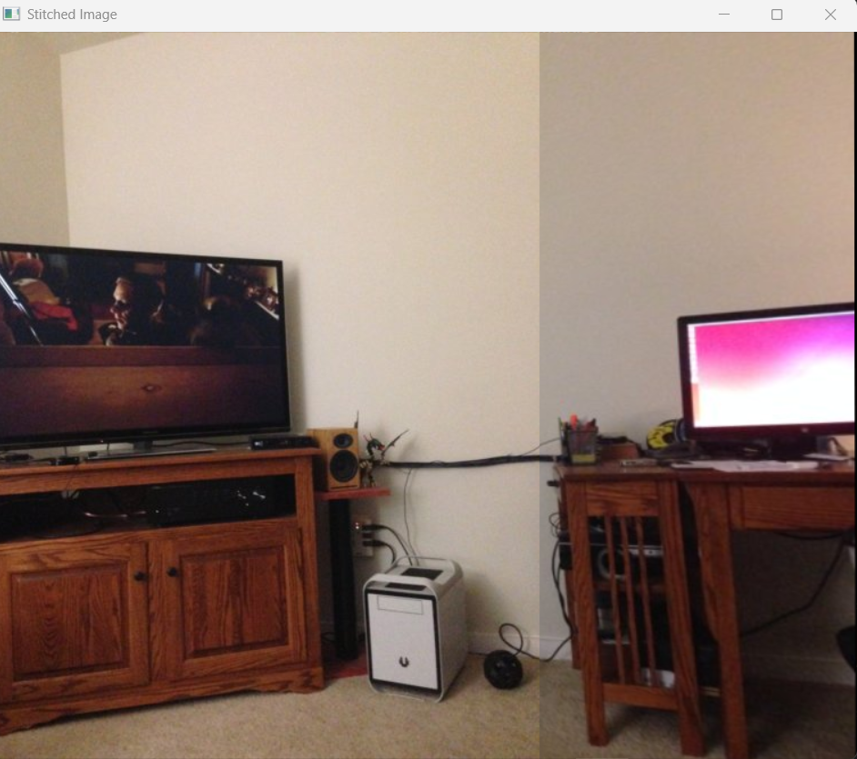

# Undergrad_Research_Mission
학부연구생 과제 저장소입니다.

# Homography 변환을 이용해 파노라마 이미지 만들기 

### 1. 제공된 코드 분석

과제 해결을 위해 `main.py`에 정의된 핵심 함수와 코드 구조를 분석했습니다.

#### A. `trim(frame)` 함수 분석

`warpPerspective` 적용 후 이미지 외곽에 생기는 검은 여백(빈 영역)을 제거하기 위한 재귀 함수입니다.

* **동작 원리**
  - 이미지의 상하좌우 가장자리 행/열의 픽셀 합(`np.sum`)이 0인지 확인합니다.
  - 픽셀 합이 0이라는 것은 해당 행/열이 전부 검정(빈 영역)임을 의미합니다.
  - 빈 행/열이 발견되면 해당 부분을 슬라이싱으로 제거하고 재귀 호출하여, 유효한 픽셀이 있는 영역만 남을 때까지 반복합니다.

#### B. 베이스라인 코드 구조 분석

##### B-1. 이미지 로드
```python
l_img = cv2.imread('1.jpg', -1)
l_img_gray = ___

r_img = cv2.imread('2.jpg', -1)
r_img_gray = ___
```
* `-1` 플래그로 원본 컬러 이미지를 그대로 읽습니다.
* `l_img_gray`, `r_img_gray`는 이후 ORB 특징점 추출을 위해 Grayscale로 변환한 이미지를 담을 변수입니다. ORB 알고리즘은 Grayscale 입력만을 처리할 수 있기 때문에 변환이 필요합니다.
* 최종 스티칭 결과는 컬러여야 하므로 원본 컬러 이미지(`l_img`, `r_img`)도 따로 보관합니다.

##### B-2. ORB 키포인트 & 디스크립터 추출
```python
orb = cv2.ORB_create()
kp1, desc1 = ___
kp2, desc2 = ___
```
* ORB(Oriented FAST and Rotated BRIEF)는 FAST로 키포인트를 검출하고, BRIEF로 디스크립터를 생성하는 알고리즘입니다. SIFT/SURF 대비 특허 문제가 없고 속도가 빠릅니다.
* ORB 객체는 생성되어 있으나, 두 이미지 각각에 대해 키포인트(`kp`)와 디스크립터(`desc`)를 동시에 추출하는 함수 호출이 비어있습니다.

##### B-3. BFMatcher를 이용한 특징점 매칭
```python
matcher = cv2.BFMatcher(cv2.NORM_HAMMING)
matches = ___
```
* BFMatcher(Brute-Force Matcher)는 한쪽 이미지의 모든 디스크립터를 다른 쪽 이미지의 모든 디스크립터와 전수 비교하여 가장 유사한 쌍을 찾습니다.
* ORB는 이진(Binary) 디스크립터이므로 유클리드 거리 대신 `NORM_HAMMING`(해밍 거리)을 사용합니다.
* `matcher` 객체는 생성되어 있으나, 실제 두 디스크립터(`desc1`, `desc2`) 간의 매칭을 수행하는 함수 호출이 비어있습니다.

##### B-4. RANSAC을 이용한 Homography 행렬 추정
```python
left_pts = ___
right_pts = ___
r2l_H, _ = cv2.findHomography( , , cv2.RANSAC, 5.0)
```
* 매칭 결과(`matches`)에서 각 매칭 쌍의 `queryIdx`(왼쪽 이미지 키포인트 인덱스)와 `trainIdx`(오른쪽 이미지 키포인트 인덱스)를 이용해 실제 픽셀 좌표를 추출하는 부분이 비어있습니다.
* `findHomography`는 두 이미지 간의 Homography 행렬(자유도 8, 최소 4개 매칭쌍 필요)을 추정합니다. `cv2.RANSAC`으로 잘못된 매칭점(outlier)을 자동 제거하고, `5.0`은 outlier 판별 임계값(픽셀 단위)입니다.
* `r2l_H`라는 변수명에서 알 수 있듯이 **오른쪽->왼쪽** 방향의 변환 행렬을 구해야 하므로 인자 순서가 중요합니다.

##### B-5. 오른쪽 이미지 투영 (warpPerspective)
```python
i_size = (l_img.shape[1]+r_img.shape[1], l_img.shape[0])
stitched_image = ___
```
* `i_size`는 두 이미지의 너비를 합산한 크기의 캔버스로, 오른쪽 이미지가 투영될 공간을 확보합니다.
* 추정된 Homography 행렬(`r2l_H`)을 이용해 오른쪽 이미지를 왼쪽 이미지의 좌표계로 원근 투영하는 함수 호출이 비어있습니다. 이 시점에서 캔버스 왼쪽 절반은 비어있는 상태입니다.

##### B-6. 왼쪽 이미지 합성
```python
stitched_image[0:l_img_gray.shape[0], 0:l_img_gray.shape[1]] = ___
```
* 투영 후 비어있는 캔버스 왼쪽 영역에 왼쪽 원본 이미지를 직접 대입하여 최종 파노라마를 완성합니다.
* 컬러 결과물을 위해 grayscale이 아닌 원본 컬러 이미지(`l_img`)를 채워야 합니다.

### 2. Problem 구역 연산 구현

#### A. Grayscale 변환
* **1. 빈칸 코드**
  - `l_img_gray = cv2.cvtColor(l_img, cv2.COLOR_BGR2GRAY)`
  - `r_img_gray = cv2.cvtColor(r_img, cv2.COLOR_BGR2GRAY)`
* **2. 역할**
  - 이후 단계에서 사용할 ORB 특징점 추출기가 Grayscale 입력만을 처리할 수 있기 때문에, 원본 컬러 이미지를 흑백으로 변환하는 단계입니다. 최종 스티칭 결과는 컬러여야 하므로 원본 컬러 이미지(`l_img`, `r_img`)는 따로 보관합니다.
* **3. 구현 방법**
  - **수학적 구조:** BGR 컬러 이미지의 각 픽셀은 Blue, Green, Red 3개 채널 값을 가집니다. Grayscale 변환은 이 3개 채널을 인간의 시각적 밝기 인식에 맞는 가중 평균으로 합산하여 단일 밝기 값으로 압축하는 연산입니다.
  - **OpenCV 해결책:** `cv2.cvtColor()` 함수에 `cv2.COLOR_BGR2GRAY` 플래그를 전달하여 3채널 컬러 이미지를 1채널 Grayscale 이미지로 변환합니다.

#### B. ORB 키포인트 & 디스크립터 추출
* **1. 빈칸 코드**
  - `kp1, desc1 = orb.detectAndCompute(l_img_gray, None)`
  - `kp2, desc2 = orb.detectAndCompute(r_img_gray, None)`
* **2. 역할**
  - 두 이미지 각각에서 특징점(Keypoint)과 디스크립터(Descriptor)를 동시에 추출하는 단계입니다. 이후 두 이미지 간의 매칭 기준이 되는 핵심 데이터를 생성합니다.
* **3. 구현 방법**
  - **수학적 구조:** ORB는 FAST(Features from Accelerated Segment Test) 알고리즘으로 코너점을 키포인트로 검출하고, BRIEF(Binary Robust Independent Elementary Features) 알고리즘으로 각 키포인트 주변의 밝기 패턴을 이진(Binary) 디스크립터로 수치화합니다. SIFT/SURF 대비 특허 문제가 없고 속도가 빠르다는 장점이 있습니다.
  - **OpenCV 해결책:** `detectAndCompute()` 함수로 키포인트 검출과 디스크립터 추출을 한 번에 수행합니다. 두 번째 인자 `None`은 마스크(특정 영역만 처리)를 사용하지 않겠다는 의미로, 이미지 전체 영역을 대상으로 처리합니다.

#### C. BFMatcher를 이용한 특징점 매칭
* **1. 빈칸 코드**
  - `matches = matcher.match(desc1, desc2)`
* **2. 역할**
  - 왼쪽 이미지의 디스크립터(`desc1`)와 오른쪽 이미지의 디스크립터(`desc2`)를 비교하여 서로 가장 유사한 특징점 쌍을 찾는 단계입니다.
* **3. 구현 방법**
  - **수학적 구조:** BFMatcher(Brute-Force Matcher)는 한쪽 이미지의 모든 디스크립터를 다른 쪽 이미지의 모든 디스크립터와 전수 비교하여 거리가 가장 가까운 쌍을 1:1로 매칭합니다. ORB는 이진(Binary) 디스크립터이므로 유클리드 거리 대신 비트가 다른 개수를 세는 해밍 거리(`NORM_HAMMING`)를 사용합니다.
  - **OpenCV 해결책:** `matcher.match(desc1, desc2)`를 호출하면 `desc1`의 각 디스크립터에 대해 `desc2`에서 가장 가까운 매칭 1개를 찾아 `DMatch` 객체 리스트로 반환합니다. 각 `DMatch` 객체는 `queryIdx`(왼쪽 키포인트 인덱스), `trainIdx`(오른쪽 키포인트 인덱스), `distance`(유사도 거리)를 포함합니다.

#### D. RANSAC을 이용한 Homography 행렬 추정
* **1. 빈칸 코드**
  - `left_pts = np.float32([kp1[m.queryIdx].pt for m in matches])`
  - `right_pts = np.float32([kp2[m.trainIdx].pt for m in matches])`
  - `r2l_H, _ = cv2.findHomography(right_pts, left_pts, cv2.RANSAC, 5.0)`
* **2. 역할**
  - 매칭된 특징점 쌍으로부터 오른쪽 이미지를 왼쪽 이미지 좌표계로 변환하는 Homography 행렬(`r2l_H`)을 추정하는 단계입니다.
* **3. 구현 방법**
  - **수학적 구조:** Homography는 한 평면의 임의의 사각형을 다른 평면의 임의의 사각형으로 매핑할 수 있는 가장 일반적인 2D 변환 모델로, 자유도가 8이며 최소 4개의 매칭쌍이 필요합니다. 매칭 결과의 `queryIdx`로 왼쪽 키포인트 좌표를, `trainIdx`로 오른쪽 키포인트 좌표를 추출하여 각각 `left_pts`, `right_pts`로 구성합니다.
  - **OpenCV 해결책:** `findHomography(right_pts, left_pts, cv2.RANSAC, 5.0)`에서 인자 순서가 `(right_pts, left_pts)`인 이유는 **오른쪽→왼쪽** 방향의 변환 행렬을 구해야 하기 때문입니다. `cv2.RANSAC`을 사용하면 잘못된 매칭점(outlier)을 자동으로 제거하고 정상치(inlier)만으로 행렬을 추정하며, `5.0`은 outlier 판별 임계값(픽셀 단위)입니다.

#### E. warpPerspective를 이용한 오른쪽 이미지 투영
* **1. 빈칸 코드**
  - `stitched_image = cv2.warpPerspective(r_img, r2l_H, i_size)`
* **2. 역할**
  - 추정된 Homography 행렬(`r2l_H`)을 이용해 오른쪽 이미지를 왼쪽 이미지의 좌표계로 원근 투영하여 합성할 캔버스를 생성하는 단계입니다. 이 시점에서 캔버스 왼쪽 절반은 비어있는 상태입니다.
* **3. 구현 방법**
  - **수학적 구조:** `i_size`는 두 이미지의 너비를 합산한 크기(`l_img.shape[1] + r_img.shape[1]`, `l_img.shape[0]`)로, 오른쪽 이미지가 투영될 충분한 공간을 확보합니다. Homography 행렬로 오른쪽 이미지의 모든 픽셀 좌표를 왼쪽 이미지 좌표계 기준으로 재배치하는 원근 변환을 수행합니다.
  - **OpenCV 해결책:** `cv2.warpPerspective(r_img, r2l_H, i_size)`로 원본 컬러 이미지(`r_img`)에 Homography 행렬을 적용합니다. Grayscale이 아닌 컬러 원본을 입력하는 이유는 최종 결과물이 컬러 파노라마여야 하기 때문입니다.

#### F. 왼쪽 이미지 합성 및 여백 제거
* **1. 빈칸 코드**
  - `stitched_image[0:l_img_gray.shape[0], 0:l_img_gray.shape[1]] = l_img`
* **2. 역할**
  - 오른쪽 이미지가 투영된 캔버스의 왼쪽 빈 영역에 왼쪽 원본 이미지를 직접 대입하여 최종 파노라마를 완성하는 단계입니다. 이후 `trim()`으로 `warpPerspective`가 만들어낸 검은 여백을 제거합니다.
* **3. 구현 방법**
  - **수학적 구조:** NumPy 배열 슬라이싱으로 캔버스의 좌측 상단 `[0:h, 0:w]` 영역을 직접 지정하여 왼쪽 원본 컬러 이미지(`l_img`)로 덮어씌웁니다. `l_img_gray.shape`를 범위 기준으로 사용하는 이유는 Grayscale과 컬러 이미지의 `shape[0]`(높이), `shape[1]`(너비)이 동일하기 때문입니다.
  - **OpenCV 해결책:** 배열 인덱싱으로 영역을 지정하고 컬러 원본(`l_img`)을 대입합니다. Grayscale(`l_img_gray`)이 아닌 컬러 원본을 채워야 최종 결과물이 컬러 파노라마로 완성됩니다.


### 3. 실행 결과

#### 최종 파노라마 이미지

* 왼쪽 이미지(`1.jpg`)와 오른쪽 이미지(`2.jpg`)가 Homography 변환을 통해 하나의 파노라마 이미지로 성공적으로 합성되었습니다.
* 두 이미지의 경계 부분에서 TV 장식장, 벽면, 바닥 등의 구조물이 자연스럽게 이어지는 것을 확인할 수 있습니다.
* ORB로 추출한 특징점과 BFMatcher 매칭, RANSAC 기반 Homography 추정이 정확하게 동작하여 이음새 없이(seamless) 연결된 결과물이 생성되었습니다.
* `trim()` 함수가 `warpPerspective` 후 생긴 검은 여백을 성공적으로 제거하여 깔끔한 최종 이미지가 출력되었습니다.